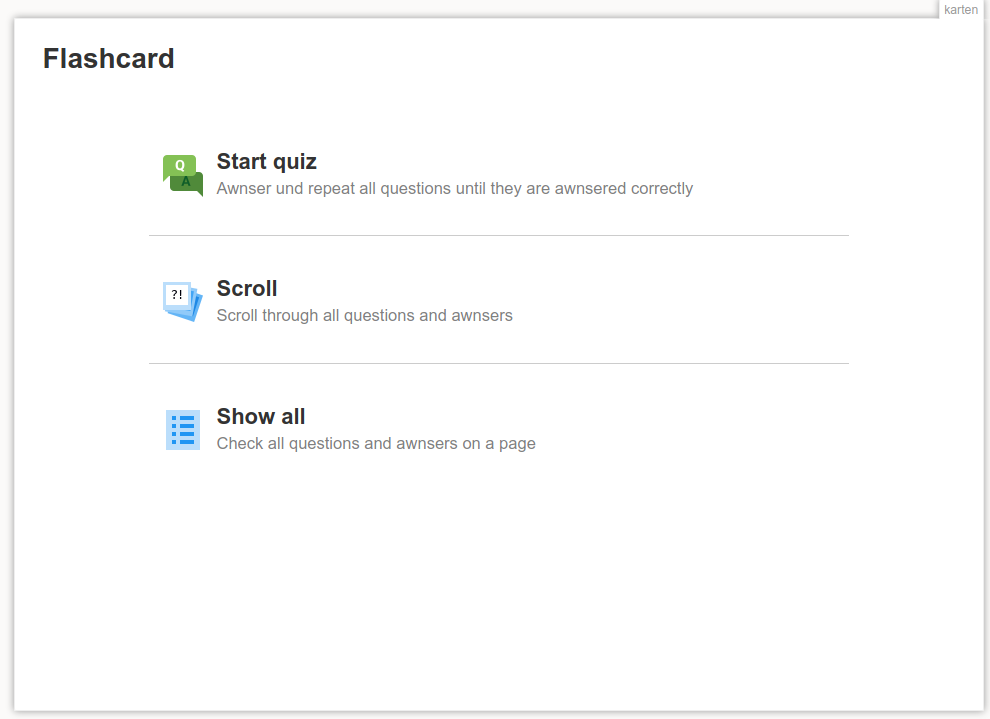
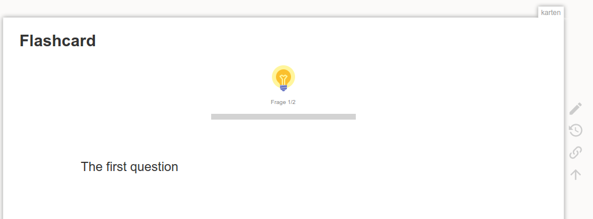
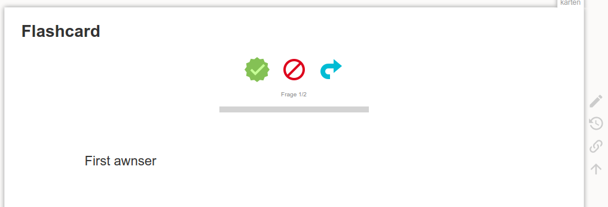

# Flashcards-Plugin for DokuWiki

Converts some content into a set of scrollable/playable flashcards. Does NOT support the Internet Explorer!



## Usage

**Important**: The option ''defer_js'' must be ''off'' for this plugin to work!

Enclose the flashcards with ``<cards>...</cards>``. The cards are separated with a horizontal line ``----``.

Example:

```
<cards>
First card
----
Second card
----
Third card
</cards>
```



## Card Counter

Placing ``~~countcards~~`` on  a page will count all the cards in the namespace recursively.

The results are cached and will only be updated on "purge" of a page"


## Issues

* The ajax-editing is somewhat buggy, does not work all the time


## Comptability

Tested with
* PHP **7.3**
* DokuWiki / **Hogfather**
